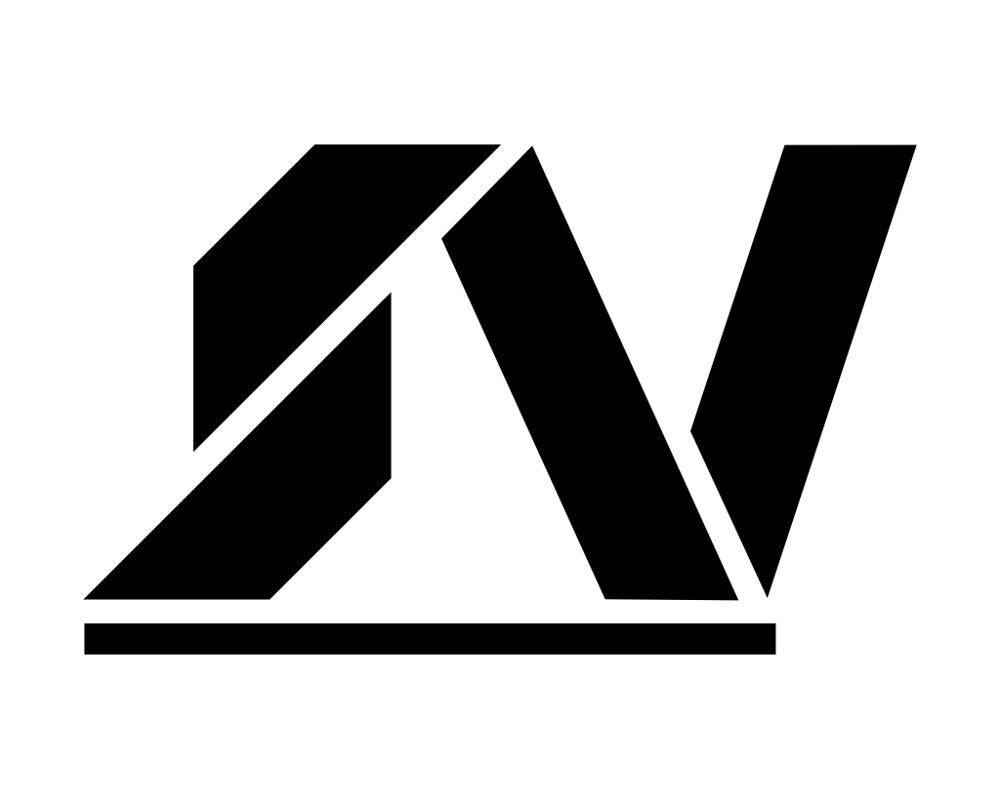

<!-- AUTO-GENERATED-CONTENT:START (STARTER) -->

  

<h1 align="center">
  vondenstein.com
</h1>

<h3 align="center">
  📸 💻 🎸
</h3>
<h3 align="center">
  Fast, modern portfolio and blog powered by Gatsby
</h3>

  This site makes use of Theme-UI for darkmode support, the GitHub GraphQL API for loading the repository list and information, an MDX-based blog, and other Gatsby plugins/features to create a clean, full-featured personal portfolio.

  
  
  

<h3 align="center">
  <a href="https://vondenstein.com/">Live Site</a>
   · 
  <a href="https://vondenstein.github.io/portfolio/">GitHub Pages</a>
</h3>

## ❓ About This Project

This site is my personal space On The Line™. I showcase my photos, music, code, and write about things. My written content is personal in nature and does not
necessarily reflect the views of my employer, my University (Geaux Tigers), or any AI I've written
now or in the future.

## 📝 License

Feel free to review the code and reuse what you feel is appropriate. However, please
respect that the files in the following directories are © Stephen Vondenstein. You **may not** reuse
anything therein without my written permission:

- content/
- src/images/

All other directories and files are MIT Licensed (where applicable).
