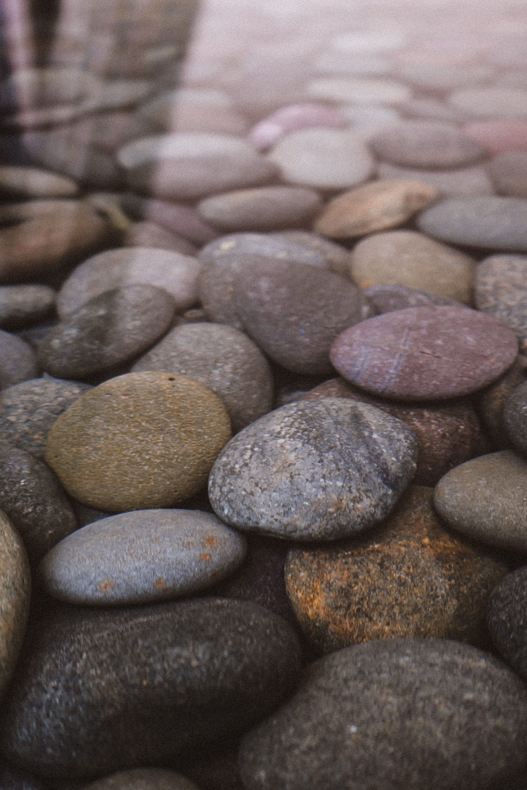
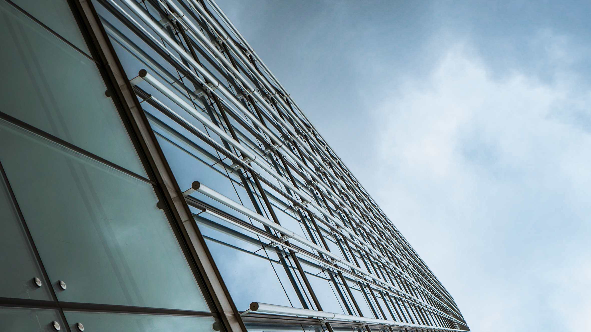

In the fall of 2017, my friend [Juan Moreno](https://www.jalexandervideography.com) and I took a road trip to Austin, TX to visit our friend Andrew. I was excited to use my recently-aquired Sony A7R II to shoot photos, and took as many as I could. While we were there, we met up with a few of Juan's friends and spent the day taking photos in downtown Austin. I had a blast on this trip and look back fondly upon the time in which I finally began to hone my photography style.

