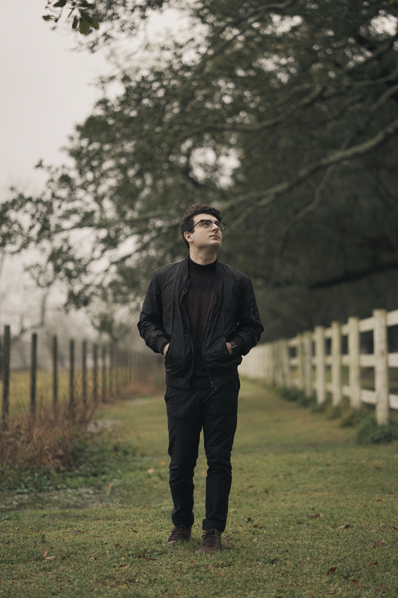
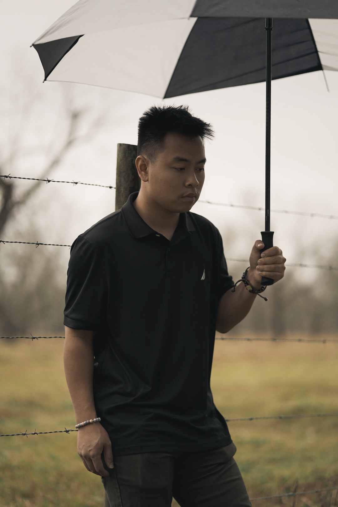
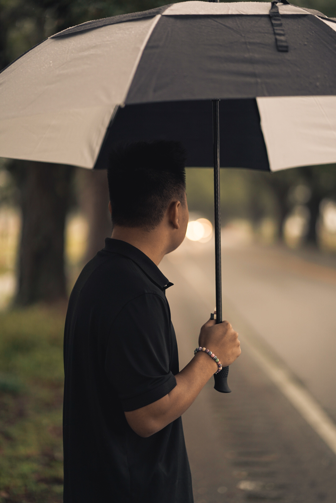

When I was in college, I worked as a wedding photographer and videographer with [Andrew Bui](https://www.neworleans.com/new-orleans-local-influencers/andrew-bui/). Many times, we had to drive across the state (or one time, the country) to reach a wedding venue, and we would usually stop to take some photos along the way.

This time, we stopped in Chalmette, LA after seeing an interesting location while driving. I love the setting of this photoset - the grass in the first photo looks like a velvet-y carpet, the rainy sky gives the whole set a moody feel, and the lack of eye contact adds a sense of mystery.

