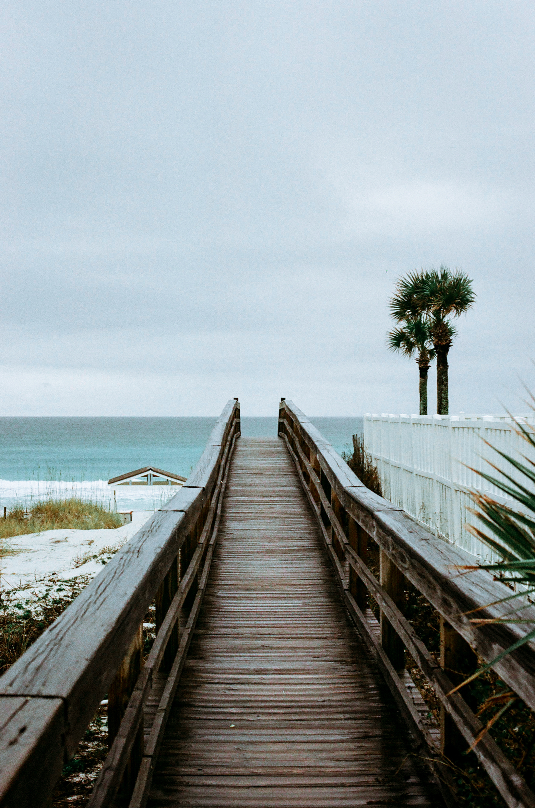
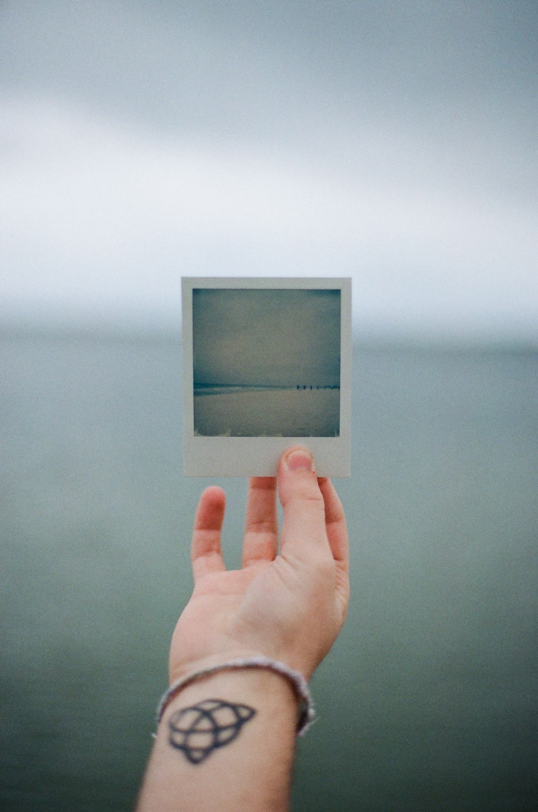
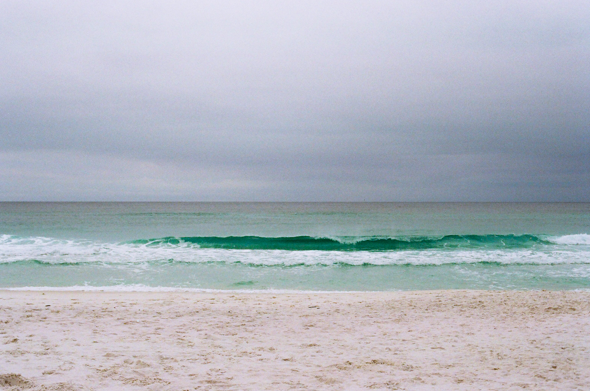

When I first started photography, my friend Juan Moreno asked me to accompany him to a wedding shoot in Florida. It was a long, rough drive through the rain - but a fun one. Taking photos of the beautiful, bluish-green ocean while standing in the rain was a surreal experience, and probably one of the primary reasons I stuck with photography.

